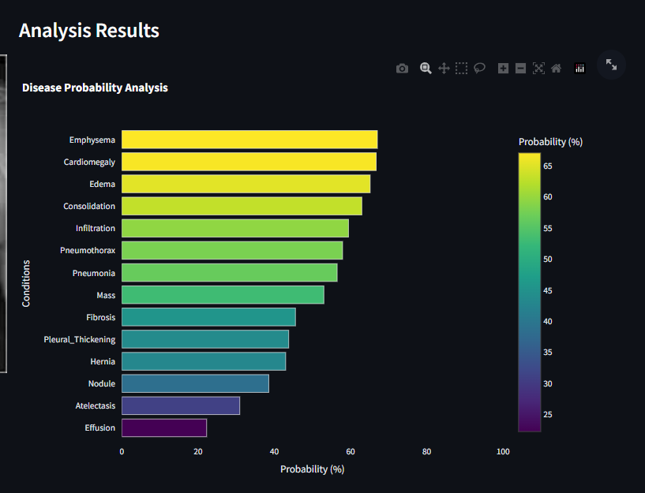
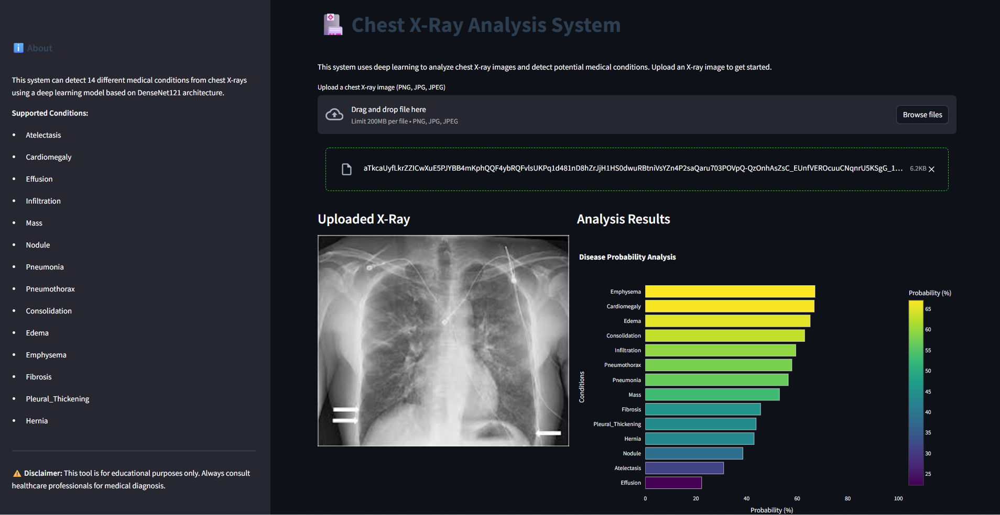

# AI Numeric Health Care – Chest X‑Ray Analysis

This project is a **Streamlit web application** for analyzing chest X‑ray images using a deep learning model based on **DenseNet121** (reimplemented from the CheXNet paper). The app predicts the probabilities of **14 thoracic diseases** and visualizes them as an interactive bar chart, together with a short list of the most likely conditions.

> ⚠️ **Medical disclaimer:** This tool is for educational and demonstration purposes only. It is **not** a medical device and must **not** be used for clinical diagnosis or treatment decisions. Always consult qualified healthcare professionals.

---

## Features

- **Web UI with Streamlit**: Upload a chest X‑ray and view predictions in the browser.
- **Pretrained CheXNet‑style model**: Uses a DenseNet121 model trained on the ChestX‑ray14 dataset.
- **Probability visualization**: Horizontal bar chart of disease probabilities with a Plotly graph.
- **Top‑finding summary**: Highlights the top 3 conditions with probability above 50%.
- **Reproducible inference**: Uses a fixed random seed for consistent predictions.

The app logic is implemented in `CheXNet-master/app.py`, which:
- Loads the pretrained model from `CheXNet-master/model.pth.tar`.
- Uses standard ImageNet normalization and resizing.
- Produces probabilities for each class listed in `CLASS_NAMES` from `model.py`.
### Pretrained CheXNet‑style model
Uses a DenseNet121 model trained on the ChestX‑ray14 dataset.



### Probability Visualization
Horizontal bar chart of disease probabilities with a Plotly graph.



---

## Project Structure (relevant parts)

- `README.md` – Project overview (this file).
- `CheXNet-master/app.py` – Streamlit application entry point.
- `CheXNet-master/model.py` – DenseNet121 model definition and class names.
- `CheXNet-master/model.pth.tar` – Pretrained model weights (required for predictions).
- `CheXNet-master/requirements.txt` – Python dependencies for the CheXNet implementation.
- `CheXNet-master/localization/` – Example images and visualizations from CheXNet.

---

## Installation

1. **Create and activate a virtual environment** (recommended):

   ```bash
   python -m venv .venv
   .venv\Scripts\activate  # on Windows
   ```

2. **Install dependencies** (from the CheXNet requirements file):

   ```bash
   cd "CheXNet-master"
   pip install -r requirements.txt
   ```

   If you plan to use GPU and CUDA, ensure that your PyTorch installation matches your CUDA version (see the official PyTorch install guide).

---

## Running the Application

From the project root (`AI nemeric helth care`), run:

```bash
cd "CheXNet-master"
streamlit run app.py
```

Then open the local URL that Streamlit prints (typically `http://localhost:8501`) in your browser.

---

## Usage

1. **Open the app** in your browser after starting Streamlit.
2. **Upload a chest X‑ray image** (`.png`, `.jpg`, or `.jpeg`).
3. The app will:
   - Show the uploaded image.
   - Run it through the DenseNet121 model.
   - Display an interactive bar chart of **probability (%)** for each of the 14 conditions.
   - List the **top 3 conditions** with probability above 50%.
4. Review the results **only as educational insight**, not as a diagnosis.

---

## Data and Model Notes

- The underlying model is a reproduction of **CheXNet for Classification and Localization of Thoracic Diseases**, trained on the **NIH ChestX‑ray14** dataset (see `CheXNet-master/README.md` for full details).
- This repository currently focuses on **inference and visualization** using the pretrained weights in `model.pth.tar`. Training and dataset download scripts live in `CheXNet-master` and follow the original CheXNet reproduction.

---

## Limitations

- Not validated as a medical device.
- Performance is inherited from the CheXNet reproduction and may vary depending on preprocessing and deployment environment.
- Predictions can be **wrong or misleading**; they must never replace a professional medical opinion.

---

## Acknowledgements

- Original CheXNet paper: *CheXNet: Radiologist-Level Pneumonia Detection on Chest X-Rays with Deep Learning*.
- CheXNet PyTorch reimplementation used here (see `CheXNet-master/README.md`) for model architecture, training approach, and performance comparisons.
